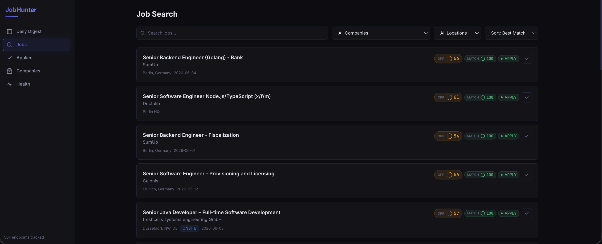

# JobHunter



**Autonomous job discovery platform that finds, filters, and scores open positions — so you spend time applying, not searching.**

## What It Does

### Discovers jobs automatically
Monitors company career pages across 12+ hiring platforms. New jobs are picked up within hours of being posted — no manual checking required.

### Filters intelligently
Only shows you what matters:
- Roles matching your profession (excludes irrelevant departments)
- Your preferred locations or remote positions
- Postings in your language
- Appropriate experience level
- Deduplicates cross-posted listings

### Scores every job against your profile
Each job gets a match score (0-100) based on how well it fits your skills, weighted by what matters most to you. Jobs are ranked so the best opportunities float to the top.

A "primary skill" gate prevents unrelated roles from getting inflated scores just because they share peripheral tools with your profile.

### Recommends action
Every job gets a clear recommendation:
- **APPLY** — strong match, go for it
- **MAYBE** — partial match, worth a look
- **SKIP** — not a fit

### Daily Digest
Each morning, see exactly what's new: how many jobs were found, how many are worth applying to, and which companies are hiring.

## Key Capabilities

| Capability | Detail |
|-----------|--------|
| Career pages monitored | Configurable, across 12+ ATS platforms |
| Crawl frequency | Every 6-12 hours |
| Scoring | Keyword match + opportunity composite |
| Filters | Role, location, language, experience, dedup |
| AI features | Cover letter generation, resume tailoring |
| Dashboard | Dark-themed web app with search, filters, applied tracking |
| MCP integration | Query jobs from any AI assistant (Claude, etc.) |

## Supported Hiring Platforms

Greenhouse, Lever, Ashby, Workday, SmartRecruiters, Workable, Personio, Recruitee, JOIN, BambooHR, Breezy, SAP SuccessFactors, Arbeitnow, Indeed (via scraping).

## How It Works

1. **Configure once** — Define your skills, preferred locations, and what roles to include/exclude in a simple config file.
2. **It runs continuously** — Jobs are crawled, filtered, scored, and ready for you.
3. **Check the dashboard** — Daily Digest shows new opportunities sorted by fit. One click opens the application page.
4. **Track progress** — Mark jobs as applied. See your pipeline at a glance.
5. **Stay informed** — Health page shows which company feeds are working, which are down.

## What Makes It Different

- **Not LinkedIn** — LinkedIn shows you what its algorithm wants you to see, buries relevant roles in spam, and locks insights behind Premium. JobHunter pulls directly from company career pages, scores transparently against YOUR skills, and surfaces everything — no paywall, no "promoted" listings, no recruiter noise.
- **Not another job board** — Pulls directly from company career pages, not aggregators. You see jobs the moment they're posted.
- **Fully configurable** — Every filter, weight, and threshold is tunable. Works for any profession: engineering, design, marketing, finance, legal — just configure your skills and role filters.
- **No account required** — Runs locally. Your profile, preferences, and application history stay on your machine.
- **Extensible** — Adding a new company takes one database entry. Adding a new hiring platform takes one extractor class.

## Getting Started

### Prerequisites

- Java 21 (Temurin)
- Node.js 18+
- Docker (for PostgreSQL)

### 1. Start the database

```bash
docker compose up -d db
```

This starts PostgreSQL 16 on port 5435.

### 2. Configure your profile

Edit `profile.yaml` and `keywords.yaml` at the project root. See [Configuration](#configuration) below for details.

### 3. Start the API

```bash
cd api
./gradlew bootRun
```

API starts on http://localhost:8080. On first run, Liquibase creates all database tables automatically.

### 4. Start the dashboard

```bash
cd dashboard
npm install
npm run dev
```

Dashboard opens at http://localhost:3000.

### 5. Add companies and trigger a crawl

Add companies and their career page URLs to the database, then trigger the first crawl:

```bash
curl -X POST http://localhost:8080/api/admin/crawl
```

### 6. Score the results

```bash
curl -X POST http://localhost:8080/api/admin/score
```

Open the dashboard — your Daily Digest is ready.

## MCP Server

The MCP server exposes JobHunter tools to any AI assistant that supports the [Model Context Protocol](https://modelcontextprotocol.io) (Claude, OpenCode, etc.).

### Setup

```bash
cd mcp-server
npm install
npm run build
```

Add to your MCP client config:

For OpenCode (`opencode.json`):

```json
{
  "mcp": {
    "jobhunter": {
      "type": "local",
      "command": ["node", "/path/to/jobhunter/mcp-server/dist/index.js"],
      "environment": {
        "JOBHUB_API_URL": "http://localhost:8080"
      },
      "enabled": true
    }
  }
}
```

For Claude Code (`.claude/settings.json` or project `.mcp.json`):

```json
{
  "mcpServers": {
    "jobhunter": {
      "command": "node",
      "args": ["/path/to/jobhunter/mcp-server/dist/index.js"],
      "env": {
        "JOBHUB_API_URL": "http://localhost:8080"
      }
    }
  }
}
```

### Tools

| Tool | Input | Description |
|------|-------|-------------|
| `get_top_jobs` | `n` (default 10) | Top jobs ranked by match score — best overall opportunities |
| `get_top_jobs_today` | `n` (default 10) | Today's new jobs sorted by match score |
| `get_jobs` | `skill`, `n` (default 10) | Search jobs containing a skill/keyword in their description |
| `get_job_keywords` | `job_id` | Extract keywords from a job (accepts UUID, 8-char short ID, or URL) |
| `mark_job_applied` | `job_id` | Mark a job as applied (accepts UUID or 8-char short ID) |
| `add_company` | `name`, `careers_url` | Register a new company with its careers page URL |

### Typical Workflow

1. **Browse top jobs:**
   ```
   → get_top_jobs(5)
   1. [a3f2c8d1] Senior Designer @ Acme Corp | Berlin | Match: 85 | Opp: 72 | APPLY
   2. [b7e4f9a2] Product Manager @ BigCo | Remote | Match: 78 | Opp: 65 | MAYBE
   ...
   ```

2. **Extract keywords for resume tailoring:**
   ```
   → get_job_keywords("a3f2c8d1")
   Senior Designer @ Acme Corp
   Keywords: Figma, design systems, user research, prototyping, accessibility, ...
   ```

   Or pass a URL directly:
   ```
   → get_job_keywords("https://boards.greenhouse.io/company/jobs/12345")
   Keywords: Python, FastAPI, AWS, Docker, ...
   ```

3. **Mark jobs as applied:**
   ```
   → mark_job_applied("a3f2c8d1")
   Job a3f2c8d1 marked as applied.
   ```

4. **Search by skill:**
   ```
   → get_jobs("figma", 5)
   1. [c9d1e2f3] UX Designer @ StartupX | Berlin | Match: 92 | Opp: 80 | APPLY
   ...
   ```

### Keyword Patterns

Keyword extraction is configured in `keywords.yaml`. See [Configuration](#configuration) below.

## Configuration

All behavior is controlled by two YAML files at the project root. No code changes needed.

### `profile.yaml` — Your Job Search Profile

Controls filtering, scoring, and recommendations. The API reads this on startup.

| Section | What it configures |
|---------|-------------------|
| `name`, `title`, `years-of-experience` | Your identity for cover letters and resume tailoring |
| `skills[]` | Each skill with proficiency level and category |
| `preferences` | Locations, salary, seniority, remote preference |
| `filters.role` | Include/exclude patterns for job titles |
| `filters.location` | Allowed cities and remote patterns |
| `filters.yoe` | Maximum years of experience to consider |
| `scoring.skill-weights` | Per-skill weight for match scoring |
| `scoring.skill-variants` | Regex patterns for recognizing each skill in JDs |
| `scoring.primary-skills` | Core skills — score capped if none match |
| `scoring.thresholds` | Score cutoffs for APPLY/MAYBE/SKIP recommendations |

Example (software engineer):
```yaml
name: Sam
title: Backend Engineer
years-of-experience: 4

skills:
  - name: Java
    proficiency: expert
  - name: Spring Boot
    proficiency: expert
  - name: Kubernetes
    proficiency: advanced

filters:
  role:
    exclude-keywords: ["manager", "designer", "devops", "frontend"]
  location:
    germany-cities: ["berlin", "munich", "hamburg", "remote"]
  yoe:
    max-years: 5

scoring:
  primary-skills: ["java", "spring boot"]
  primary-skill-cap: 70
  skill-weights:
    java: 5.0
    spring boot: 4.5
    kubernetes: 3.0
```

Example (product designer):
```yaml
name: Alex
title: Product Designer
years-of-experience: 3

skills:
  - name: Figma
    proficiency: expert
  - name: User Research
    proficiency: advanced
  - name: Design Systems
    proficiency: advanced

filters:
  role:
    include-patterns: ["designer", "ux", "ui", "product design"]
    exclude-keywords: ["engineer", "developer", "manager", "intern"]
  location:
    germany-cities: ["berlin", "munich", "remote"]
  yoe:
    max-years: 5

scoring:
  primary-skills: ["figma", "user research"]
  primary-skill-cap: 70
  skill-weights:
    figma: 5.0
    user research: 4.5
    design systems: 4.0
```

Restart the API after editing.

### `keywords.yaml` — Keyword Extraction Patterns

Controls what the `get_job_keywords` MCP tool extracts from job descriptions. Each category contains regex patterns that match against JD text.

**Customize this with YOUR skill set.** Add the tools, methodologies, and domain terms relevant to your profession so extracted keywords align with what matters for your resume tailoring.

The default `keywords.yaml` ships with software engineering terms, but you can replace or extend it for any field:

| Profession | Example categories you might add |
|-----------|----------------------------------|
| Software Engineer | languages, frameworks, cloud, databases, architecture |
| Product Designer | design tools, methodologies, deliverables, research methods |
| Data Scientist | ML frameworks, statistical methods, data tools, visualization |
| Marketing | platforms, analytics tools, methodologies, channels |
| Finance | financial models, regulations, tools, certifications |

Patterns support regex syntax:
- `\w*` — suffix wildcard (`deploy\w*` matches deployment, deploying, deployed)
- `\s*` — optional space (`Spring\s*Boot` matches "Spring Boot" and "SpringBoot")
- `[- ]` — dash or space (`event[- ]driven` matches both forms)
- `?` — optional char (`OAuth2?` matches OAuth and OAuth2)

Example — adding design terms:
```yaml
design_tools:
  - Figma
  - Sketch
  - Adobe\s*XD
  - Framer
  - Miro

methodologies:
  - design\s*thinking
  - user\s*research
  - usability\s*test\w*
  - A\/B\s*test\w*
  - accessibility
  - WCAG
```

Changes take effect on next MCP tool invocation (no rebuild needed).
